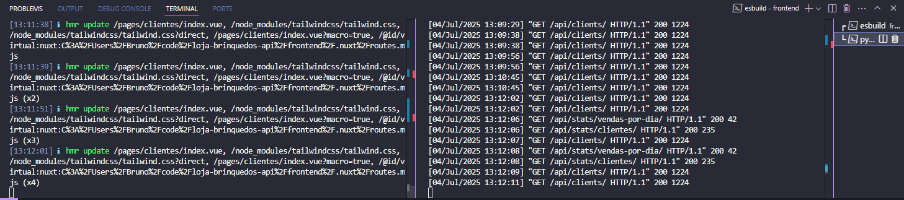
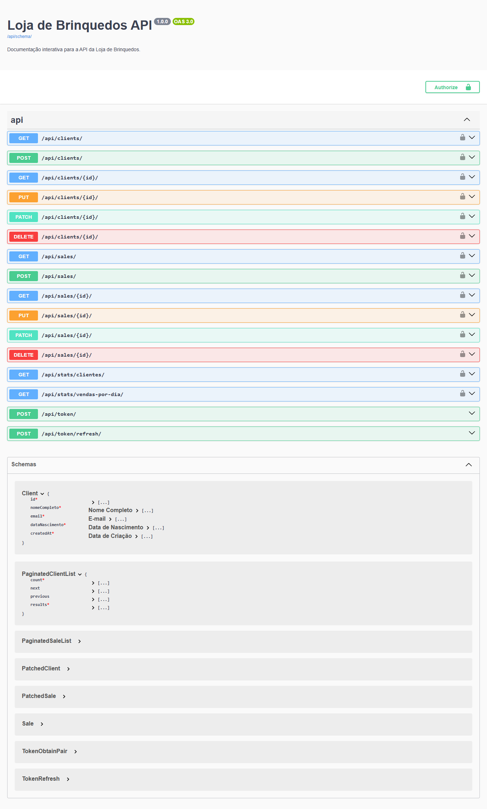
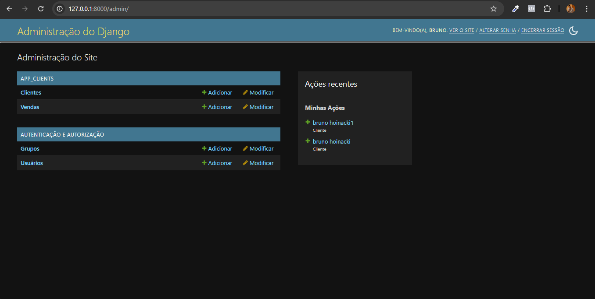
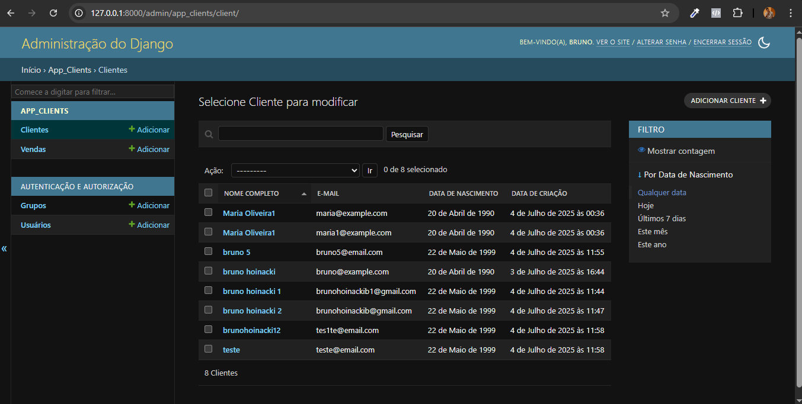
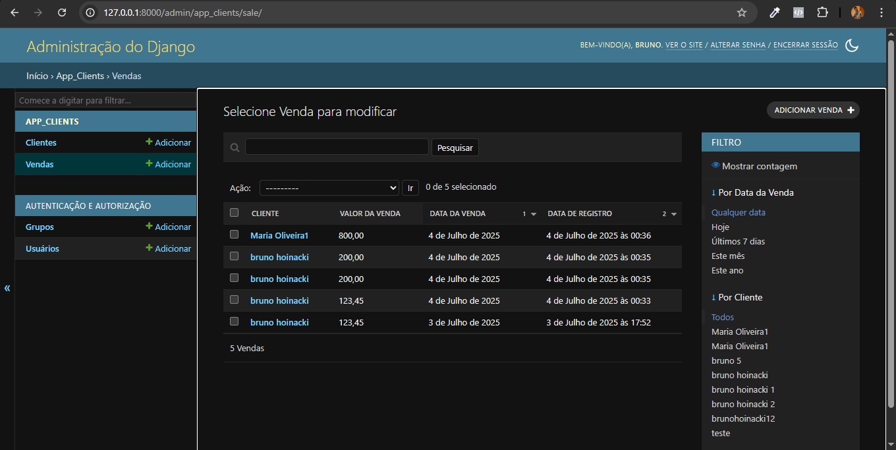
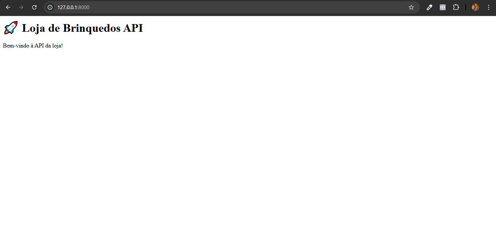
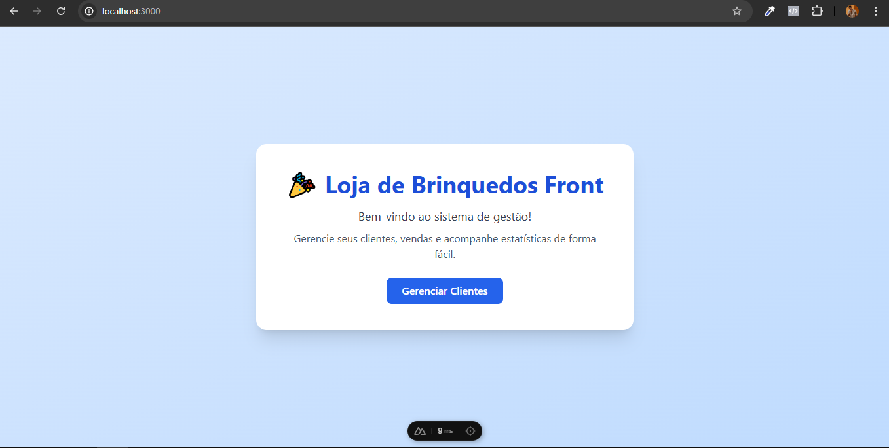
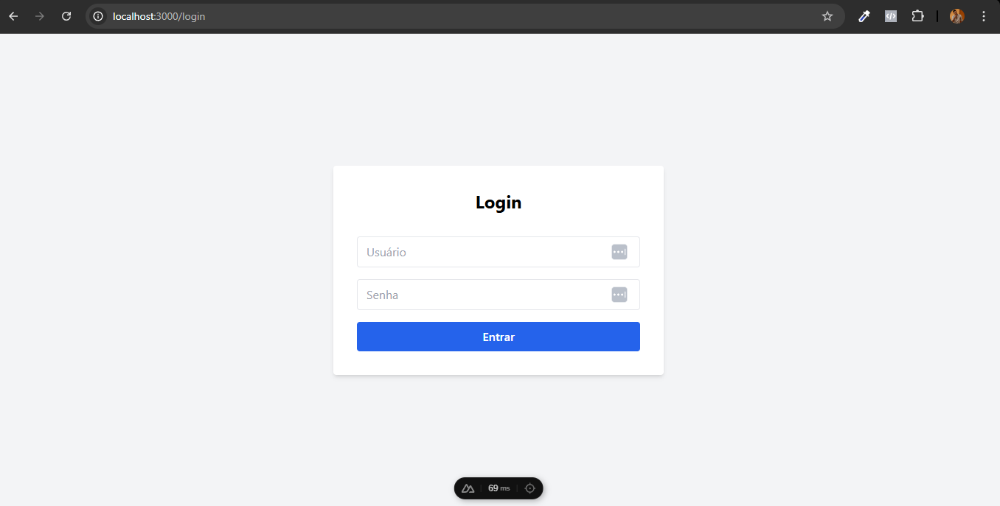
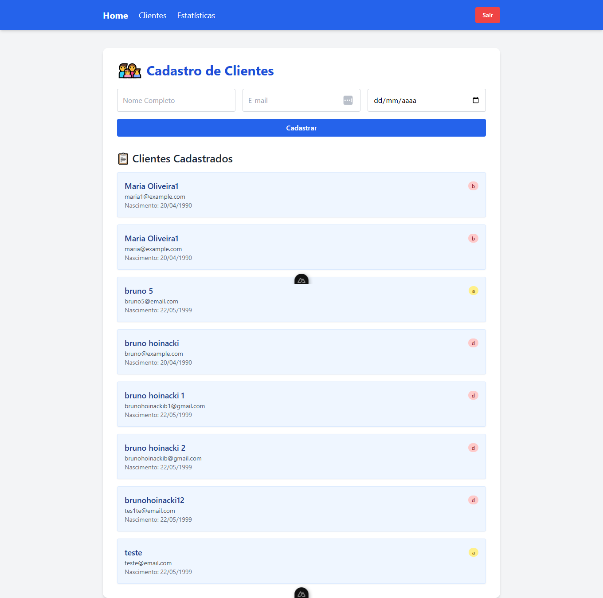
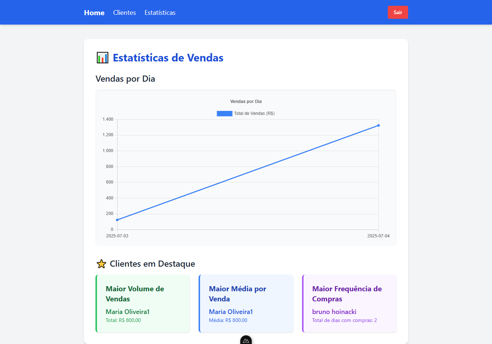

# Projeto Loja de Brinquedos - API e Frontend

Este é um projeto full stack para gerenciar clientes e vendas de uma loja de brinquedos. O **backend é desenvolvido com Django REST Framework** para a API, e o **frontend será construído com Nuxt.js (Vue.js)** para a interface do usuário.

## Estrutura do Projeto

O projeto está organizado em um monorepo, com as seguintes pastas principais:

-   `backend/`: Contém todo o código da API Django (Python), incluindo modelos, views, serializadores, URLs e testes.
-   `frontend/`: Contém todo o código da aplicação frontend (Nuxt.js / Vue.js).
-   `venv/`: Ambiente virtual Python para isolar as dependências do backend.

---

## Como o Sistema Vai Funcionar

### Backend (API Django)

O backend será o coração do sistema, responsável por toda a lógica de negócio e persistência de dados. Ele fornecerá uma API RESTful para:

1.  **Gerenciamento de Clientes**: Permitirá o cadastro, listagem (com filtros por nome/e-mail), exclusão e edição das informações de clientes.
2.  **Gerenciamento de Vendas**: Registrará as vendas associadas a cada cliente.
3.  **Autenticação e Autorização**: Todas as rotas sensíveis serão protegidas por autenticação JWT (JSON Web Tokens), garantindo que apenas usuários autorizados possam acessá-las.
4.  **Estatísticas Avançadas**: Fornecerá endpoints para calcular e retornar:
    * O total de vendas por dia.
    * O cliente com o maior volume total de vendas.
    * O cliente com a maior média de valor por venda.
    * O cliente com o maior número de dias únicos com vendas registradas (frequência de compra).
5.  **Testes Automatizados**: Contará com uma suíte de testes para garantir a robustez e a correção das funcionalidades da API.
6.  **Documentação Interativa (Swagger/OpenAPI)**: Todos os endpoints da API estão mapeados e podem ser explorados e testados através da interface interativa do Swagger UI.

### Frontend (Nuxt.js)

O frontend será a interface interativa que os usuários irão interagir. Ele será responsável por:

1.  **Interface de Usuário Amigável**: Permitirá a adição de novos clientes com nome, e-mail e data de nascimento.
2.  **Listagem de Clientes Dinâmica**: Exibirá a lista de clientes, permitindo operações de edição e exclusão.
3.  **Autenticação Simplificada**: Oferecerá uma forma simples de autenticação para que o usuário possa acessar as funcionalidades protegidas da API.
4.  **Consumo e Visualização de Dados da API**:
    * Consumirá os endpoints de estatísticas do backend.
    * Exibirá um gráfico visualmente atraente com o total de vendas por dia.
    * Destacará visualmente os clientes com maior volume de vendas, maior média de valor por venda e maior frequência de compras.
5.  **Tratamento e Normalização de Dados**: Um ponto crucial será a capacidade de consumir a API de listagem de clientes (que pode retornar dados em uma estrutura "desorganizada" ou redundante) e **tratar/normalizar esses dados** antes de apresentá-los na interface.
6.  **Recurso Visual Adicional**: Para cada cliente, um campo visual indicará a primeira letra do alfabeto que ainda não apareceu no nome completo do cliente. Se todas as letras de A-Z estiverem presentes, exibirá '-'.

---

## Requisitos do Sistema

Para rodar este projeto, você precisará ter instalado:

-   **Python 3.9+** (com `pip` incluído)
-   **Node.js 16+** (para o frontend, com `npm` ou `yarn` incluído)

## Configuração e Execução do Backend (API Django)

Siga os passos abaixo para configurar e rodar a API:

1.  **Navegue para a pasta raiz do projeto:**
    ```bash
    cd loja-brinquedos-api
    ```

2.  **Crie e ative o ambiente virtual Python:**
    ```bash
    python -m venv venv
    .\venv\Scripts\Activate.ps1
    ```
    *Se você estiver usando o terminal WSL/Linux/macOS, use:*
    ```bash
    source venv/bin/activate
    ```

    *caso queira desativar o ambiente virtual, use:*
    ```bash
    deactivate
    ```

3.  **Navegue para a pasta do backend:**
    ```bash
    cd backend
    ```

4.  **Instale as dependências Python:**
    Com o ambiente virtual ativado (você verá `(venv)` no prompt):

    ```bash
    pip install -r requirements.txt
    ```

5.  **Realize as migrações do banco de dados:**
    ```bash
    cd toy_store_project
    python manage.py migrate
    ```

6.  **Crie um superusuário (opcional, para acessar o painel admin do Django):**
    ```bash
    python manage.py createsuperuser
    ```
    Siga as instruções para criar o usuário e senha.

7.  **Execute o servidor de desenvolvimento Django:**
    ```bash
    python manage.py runserver
    ```
    A API estará disponível em `http://127.0.0.1:8000/`.
    Admin do Django estará disponível em `http://127.0.0.1:8000/admin/`.

8.  **Acesse a Documentação da API (Swagger UI):**
    Depois que o servidor Django estiver rodando, você pode explorar todos os endpoints da API, suas regras e testá-los diretamente através da interface interativa do Swagger UI em:
    `http://127.0.0.1:8000/api/schema/swagger-ui/`

---

## Configuração e Execução do Frontend (Nuxt.js)

Siga os passos abaixo para configurar e rodar a aplicação frontend:

1.  **Navegue para a pasta do frontend:**
    ```bash
    cd loja-brinquedos-api\frontend
    ```

2.  **Instale as dependências JavaScript:**
    ```bash
    npm install
    ```

3.  **Inicie a aplicação frontend:**
    ```bash
    npm run dev
    ```
    A aplicação geralmente será aberta em `http://localhost:3000/`.

---

## Testes

### Backend
Para rodar os testes automatizados do backend:

1.  Ative o ambiente virtual e navegue para a pasta.
    ```bash
    cd loja-brinquedos-api\backend\toy_store_project
    ```
2.  Execute:
    ```bash
    python manage.py test app_clients
    ```

### Frontend (Teste de Normalização de Dados de Cliente)
Para testar a funcionalidade de normalização de dados de clientes com a estrutura "desorganizada" especificada no desafio:

1.  Abra o arquivo `frontend/pages/clientes/index.vue`.
2.  Localize a variável `USE_SIMULATED_DATA`:
    ```typescript
    const USE_SIMULATED_DATA = false; // Altere para 'true' para usar os dados simulados
    ```
3.  **Para testar a normalização com dados simulados:** Mude o valor para `true`. Salve o arquivo e recarregue a página de clientes no navegador (`http://localhost:3000/clientes`). Você deverá ver os clientes "Ana Beatriz (Simulado)", "Carlos Eduardo (Simulado)" e "Bruno (Simulado)", extraídos da estrutura desorganizada simulada. Um cliente adicional ("abcdefghijklmnopqrstvuxywz (Simulado)") também estará presente para demonstrar a exibição do hífen.

4.  **Para usar os dados da sua API Django real:** Mude o valor de `USE_SIMULATED_DATA` de volta para `false`. Salve o arquivo e recarregue a página. A lista de clientes será populada com os dados do seu backend real.

---

## 📬 Collection do Postman

Para facilitar os testes da API, uma collection do Postman foi criada e incluída no projeto.

### 🔽 Como usar

1. Abra o Postman.
2. Clique em **Import** (ícone no canto superior esquerdo).
3. Selecione a opção **"Upload Files"**.
4. Escolha o arquivo localizado em:

```bash
postman/loja-brinquedos.postman_collection.json
```

5. Após a importação, todos os endpoints da API estarão organizados e prontos para testes.

---

## Desafio: Detalhes da Implementação

Este projeto visa avaliar o domínio de stack, boas práticas, raciocínio lógico e estruturação, com os seguintes pontos chave a serem abordados:

### ✅ Para o Backend (API Django):
-   [x] Criar um projeto Django com uma aplicação chamada `toy_store`
-   [x] Criar um modelo `Client` com os campos:
    -   `nomeCompleto` (string)
    -   `email` (string, único)
    -   `dataNascimento` (data)
    -   `created_at` (data/hora, padrão para o momento da criação)
-   [x] Criar um modelo `Sales` com os campos:
    -   `Client` (chave estrangeira para `Client`)
    -   `valor` (decimal)
    -   `data` (data)
    -   `created_at` (data/hora, padrão para o momento da criação)
-   [x] Permitir cadastrar clientes de uma loja de brinquedos via UI admin (nome, e-mail, data de nascimento)
-   [x] Permitir cadastrar clientes de uma loja de brinquedos via api (nome, e-mail, data de nascimento)
-   [X] Listar os clientes via UI admin
-   [x] Listar os clientes via API
-   [x] Listar cliente com opções de filtros via UI admin (por nome ou e-mail)
-   [x] Listar cliente com opções de filtros via API (por nome ou e-mail)
-   [x] Permitir deletar um cliente via UI admin
-   [x] Permitir deletar um cliente via API
-   [x] Permitir editar informações de um cliente via UI admin
-   [x] Permitir editar informações de um cliente via API
-   [x] Requer autenticação (JWT) para acessar as rotas
-   [x] Permitir cadastrar vendas via API
-   [x] Permitir deletar uma venda via API
-   [x] Permitir editar informações de uma venda via API
-   [x] Listar vendas via API (com filtros por cliente ou data, se pertinente)
-   [x] Adicionar testes automatizados (para Clientes e Vendas)
-   [x] Criar uma rota de estatísticas que retorne o total de vendas por dia
-   [x] Criar outra rota que retorne:
    -   [x] O cliente com o maior volume de vendas
    -   [x] O cliente com a maior média de valor por venda
    -   [x] O cliente com o maior número de dias únicos com vendas registradas (frequência de compra)
-   [x] Banco de dados obrigatório no backend (SQLite)

### ✅ Para o Frontend (Nuxt.js):
-   [x] Criar um projeto Nuxt.js
-   [x] Rodar backend e frontend simultaneamente
-   [x] Permitir adicionar clientes com nome, e-mail e data de nascimento
-   [x] Listar os campos conforme achar pertinente
-   [x] Adicionar autenticação simples
-   [x] Consumir a API de estatísticas para:
    -   [x] Exibir um gráfico com o total de vendas por dia
    -   [x] Destacar visualmente:
        -   [x] O cliente com maior volume de vendas
        -   [x] O cliente com maior média de valor por venda
        -   [x] O cliente com maior frequência de compras
-   [x] Adicionar um campo visual que indique, para cada cliente, a primeira letra do alfabeto que ainda não apareceu no nome completo do cliente. Se todas as letras de a-z estiverem presentes, exibir '-'.
-   [x] Tratar e normalizar a resposta da API de listagem de clientes, conforme o formato JSON fornecido
-   **Ao consumir a API de listagem de clientes, considerar que o endpoint pode retornar uma estrutura desorganizada ou com dados redundantes.** O formato exato do JSON a ser tratado no front-end é:
    ```json
    {
        "data": {
            "clientes": [
                {
                    "info": {
                        "nomeCompleto": "Ana Beatriz",
                        "detalhes": {
                            "email": "ana.b@example.com",
                            "nascimento": "1992-05-01"
                        }
                    },
                    "estatisticas": {
                        "vendas": [
                            {
                                "data": "2024-01-01",
                                "valor": 150
                            },
                            {
                                "data": "2024-01-02",
                                "valor": 50
                            }
                        ]
                    }
                },
                {
                    "info": {
                        "nomeCompleto": "Carlos Eduardo",
                        "detalhes": {
                            "email": "cadu@example.com",
                            "nascimento": "1987-08-15"
                        }
                    },
                    "duplicado": {
                        "nomeCompleto": "Carlos Eduardo"
                    },
                    "estatisticas": {
                        "vendas": []
                    }
                }
            ]
        },
        "meta": {
            "registroTotal": 2,
            "pagina": 1
        },
        "redundante": {
            "status": "ok"
        }
    }
    ```
    O candidato deve extrair corretamente os dados relevantes e ignorar as informações desnecessárias ou duplicadas.

---

## 📸 Prints do Sistema

### 🖥️ Servidores em Execução



### 🔎 Swagger da API



### 🛠️ Django Admin

#### Dashboard principal



#### Lista de Clientes



#### Lista de Vendas



#### Página Inicial do Admin



### 💻 Frontend (Nuxt.js)

#### Página Inicial



#### Tela de Login



#### Listagem de Clientes



#### Estatísticas e Gráficos



---
